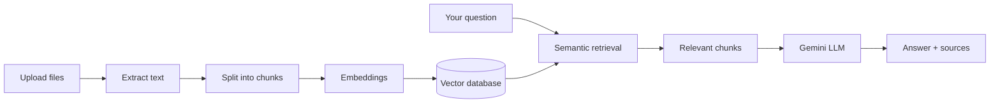

# 📚 StudyRAG

**An AI study assistant that answers from *your own* course materials.**
Upload lecture slides, notes and PDFs, then ask questions, take quizzes and practise flashcards, with every answer pointing back to its source.

> Built as an AI Capstone Project by Htet Aung Wai.

---

## The problem

Students collect lots of slides, notes and PDFs, which makes it slow to find a specific fact when studying. General-purpose AI assistants answer from broad training data, not from the student's actual course materials, so they can sound confident and still be wrong about *your* course.

StudyRAG uses **Retrieval-Augmented Generation (RAG)**: it first finds the relevant passages in your documents, then asks a language model to answer using only those passages and to cite them.

## Features

| | |
|---|---|
| 💬 **Chat with sources** | Ask questions and get answers with numbered citations (file and page or slide). Choose any mix of **Documents**, **Notes** and **Web** as the source. |
| 🧩 **Combines sources** | A question like "How many internship hours do I have left?" can use a requirement from a document and your progress from a note. |
| 🚫 **No guessing** | If the answer isn't in the selected sources, the assistant says so instead of making something up. |
| 📁 **Folders (tracks)** | Organise documents and notes into folders such as *Data Science*, and limit chat or quizzes to one folder. |
| 📝 **Notes** | Write notes inside the app; they are searchable like any document. |
| 🧠 **Quizzes** | Generate multiple-choice quizzes from your material, with scoring, explanations and sources. |
| 🃏 **Flashcards** | Flip, shuffle and mark cards as known. Export to CSV for Anki. |
| 🌐 **Web mode** | Search the web (DuckDuckGo, with Wikipedia as a backup) and answer with links. |
| 📊 **Evaluation page** | Measure retrieval hit rate and MRR, and compare StudyRAG's accuracy with plain Gemini that has no access to your files. |
| ⚙️ **Model picker** | Choose which Gemini model to use if one is unavailable. |

Supported files: **PDF, PPTX, DOCX, TXT, MD**.

## How it works



1. **Extract:** text is pulled from each file, keeping page or slide numbers.
2. **Chunk:** text is split into overlapping pieces so each one stays focused.
3. **Embed and store:** each chunk is turned into a vector and saved in ChromaDB.
4. **Retrieve:** your question is embedded and the most similar chunks are found, with weak matches filtered out.
5. **Generate:** Gemini answers using only the retrieved chunks and cites them as `[1]`, `[2]`, and so on. Only the sources it actually cited are shown.

## Tech stack

| Area | Tools |
|---|---|
| App / UI | Streamlit |
| File parsing | PyMuPDF, python-pptx, python-docx |
| Embeddings | sentence-transformers (`all-MiniLM-L6-v2`) locally, or the Gemini embedding API |
| Vector store | ChromaDB |
| LLM | Google Gemini (`google-genai`) |
| Web search | `ddgs` (DuckDuckGo), Wikipedia API, trafilatura |

Everything runs on free tools and the Gemini API free tier.

## Project structure

```
studyrag/
├── app.py                 # Streamlit app: Chat, Study, Documents, Notes, Evaluation pages
├── requirements.txt       # Core dependencies
├── requirements-local.txt # Adds the local embedding model
└── core/
    ├── parsers.py         # File parsing and chunking
    ├── embeddings.py      # Local and Gemini embedding backends
    ├── index.py           # Vector store: add, search, folders, move, delete
    ├── llm.py             # Gemini calls, prompts, citations
    ├── notes.py           # Notes storage and indexing
    ├── folders.py         # Folder (track) management
    ├── study.py           # Quiz and flashcard generation
    ├── web.py             # Web search for Web mode
    ├── evaluate.py        # Evaluation metrics
    └── workspace.py       # Per-user data separation
```

## Getting started (run locally)

You need Python 3.10+ and a free Gemini API key from [Google AI Studio](https://aistudio.google.com/apikey).

```bash
git clone https://github.com/<your-username>/studyrag.git
cd studyrag
python -m venv .venv
.venv\Scripts\activate            # Mac/Linux: source .venv/bin/activate
pip install -r requirements-local.txt
```

Create a file named `.env` next to `app.py`:

```
GEMINI_API_KEY=your_key_here
```

Then start the app:

```bash
streamlit run app.py
```

## Evaluation

The **Evaluation** page tests the main claim of the project: answers grounded in your documents are more reliable than a general model's. You enter test questions with keywords that a correct answer must contain, and the page reports:

- **Retrieval hit rate:** how often the right passage was among the retrieved chunks
- **MRR:** how high the right passage ranked
- **StudyRAG accuracy** vs **plain Gemini accuracy** on the same questions

Correctness is checked by keyword matching, so it is a simple measure rather than a full judgement of answer quality.

## Limitations

- Scanned PDFs and images inside slides are not read (there is no OCR), only text.
- Answers are only as good as retrieval. Very short notes or unusual wording can be missed, and the app has a retrieval-tuning panel for this.
- The free Gemini tier has rate limits, and available models change over time.
- Web mode depends on search results, which can be incomplete or unreliable.
- Text excerpts from your files are sent to Google's Gemini API to generate answers, so avoid uploading sensitive documents.

## Reference

Lewis, P., Perez, E., Piktus, A., Petroni, F., Karpukhin, V., Goyal, N., Küttler, H., Lewis, M., Yih, W., Rocktäschel, T., Riedel, S., & Kiela, D. (2020). *Retrieval-Augmented Generation for Knowledge-Intensive NLP Tasks.* Advances in Neural Information Processing Systems, 33. https://arxiv.org/abs/2005.11401

StudyRAG applies the same idea to students' own uploaded documents instead of Wikipedia.

## Notes

This project was created for educational purposes as a university capstone project.
